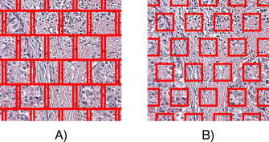

This is the real and first step of the entire project. Sample naming, directory structure and saving system is defined in the content of this folder.

---

## WSI tiling

Here is described the process of tiling: subdiving a Whole Slide Image (**WSI**) in square-shaped smaller images named **tiles**.

Considering that these two omics share the same Visium probe-printed support, the creation of the non-overlapping tiles directly relates to the spots dimentions and distances in the grid system: the **size of the tiles** was chosen to be **100 µm** and **68 µm**. The 55 µm option was discarded after finding out that in some cases not a single nucleus was captured, leading to non-informative content.

Example of tile grid and size:

  

**A)** **100 µm** tiles
**B)** **68 µm** tiles

---
Folder content:
- `1_tiles_from_sATAC_manual_alignment.ipynb` describes the tiling process for the Spatial ATAC sample
- `1_tiles_from_visium.ipynb` describes the tiling process for the Visium sample
- `output\` folder contains the tiles, organised per sample, WSI (original or normalised) and size
- `figures\` folder contains the important figures derived from the initial Jupyter Notebooks organised per sample 
- `utils\` folder contains the environments `.yaml` files and eventual useful scripts 

