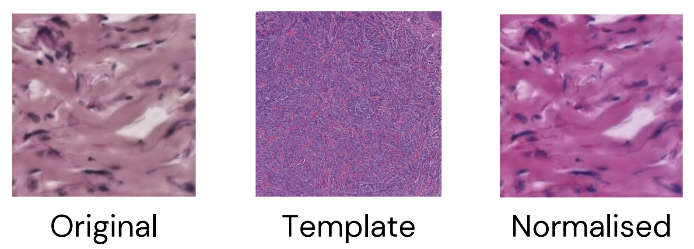

## Image normalisation

Here is described the process of **tile normalisation**. This mainly happen by transfer of the color profile from a **reference image** to the target one (our tiles).

Example:

  

In total, 12 implementations, derived from a few foundation algorithms, were tried:
1) **Macenko's method** from **StainTools package**
2) **Reinhard's method** from **StainTools package**
3) **Vahadane's method** from **StainTools package**
4) **Macenko's method** without masking from **HistomicsTK package**
5) **Macenko's method** with masking from **HistomicsTK package**
6) **Reinhard's method** without masking from **HistomicsTK package**
7) **Reinhard's method** with masking from **HistomicsTK package**
8) **Vahadane's method** with GPU from **TorchVahadane package**
9) **Vahadane's method** with CPU from **TorchVahadane package**
10) **StainNet's method** from **StainNet package**
11) **StainGAN's method** with model A from **StainNet package**
12) **StainGAN's method** with model B from **StainNet package**

These methods were also applied on the WSIs and described in [step 0](../0_WSI_alignment_and_normalisation/).

### Reference image

Even if the inside the `reference_images` folder there more than one image, in the end we only used the template `reference_full.jpeg`.

### Evaluation of normalisation
To evaluate whether color normalisation didn't add artifacts but just changed the color profile of the image, we used three pairwise (original vs normalised) metrics:
- SSIM ➜ Structural Similarity Index Measure
- LPIPS ➜ Learned Perceptual Image Patch Similarity
- PSNR ➜ Peak Signal-to-Noise Ratio
 
 

---
**Folder content:** 

`2_image_normalisation` 
`├── 2_image_normalisation_histomicstk.ipynb` &rarr; normalisation process with **HistomicsTK package** 
`├── 2_image_normalisation_stainnet.ipynb` &rarr; normalisation process with **StainNet package** 
`├── 2_image_normalisation_staintools.ipynb` &rarr; normalisation process with **StainTools package** 
`├── 2_image_normalisation_torchvahadane.ipynb` &rarr; normalisation process with **TorchVahadane package** 
`├── 2_sATAC_images_visualisation.ipynb` &rarr; results of normalisation for the Spatial ATAC sample 
`├── 2_visium_images_visualisation.ipynb` &rarr; results of normalisation for the Visium sample 
`├── scripts_for_tiles68/` &rarr; Python scripts for 68 µm tile normalisation derived from the respective notebook 
`├── scripts_for_tiles100/` &rarr; Python scripts for 100 µm tile normalisation derived from the respective notebook 
`├── figures/` &rarr; figures derived from the scripts or Jupyter Notebooks organised per sample  
`├── utils/` &rarr; contains the used environments `.yaml` files and eventual useful scripts  
`├── output/` &rarr; contains the normalised tiles, organised per sample, WSI (original or normalised) and size, and results of metrics evaluation 

