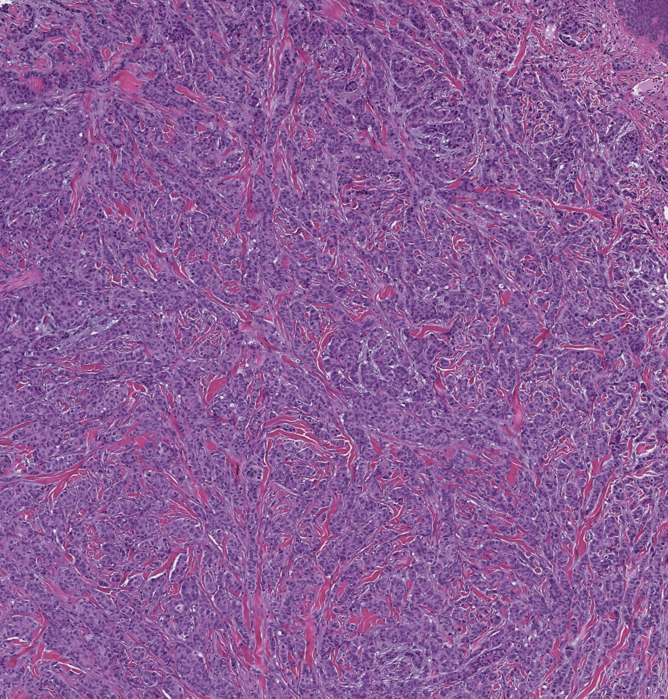

This is the real and first step of the entire project. Sample naming, directory structure and saving system is defined in the content of this folder.

---

## Image normalisation

Here is described the process of **tile normalisation**. This mainly happen by transfer of the color profile from a **reference image** to the target one (our tiles).

In total, 12 implementations, derived from a few foundation algorithms, were tried:
1) **Macenko's method** from **StainTools package**
2) **Reinhard's method** from **StainTools package**
3) **Vahadane's method** from **StainTools package**
4) **Macenko's method** without masking from **HistomicsTK package**
5) **Macenko's method** with masking from **HistomicsTK package**
6) **Reinhard's method** without masking from **HistomicsTK package**
7) **Reinhard's method** with masking from **HistomicsTK package**
8) **Vahadane's method** with GPU from **TorchVahadane package**
9) **Vahadane's method** with CPU from **TorchVahadane package**
10) **StainNet's method** from **StainNet package**
11) **StainGAN's method** with model A from **StainNet package**
12) **StainGAN's method** with model B from **StainNet package**

These methods were also applied on the WSIs and described in [step 0](../0_WSI_alignment_and_normalisation/).

### Reference image

Even if the inside the `reference_images` folder there more than one image, in the end we only used the template `reference_full.jpeg`, shown here:

  

---
**Folder content:**
- `2_image_normalisation_histomicstk.ipynb` describes the normalisation process with **HistomicsTK package**
- `2_image_normalisation_stainnet.ipynb` describes the normalisation process with **StainNet package**
- `2_image_normalisation_staintools.ipynb` describes the normalisation process with **StainTools package**
- `2_image_normalisation_torchvahadane.ipynb` describes the normalisation process with **TorchVahadane package**
- `2_sATAC_images_visualisation.ipynb` shows the results of normalisation for the Spatial ATAC sample
- `2_visium_images_visualisation.ipynb` shows the results of normalisation for the Visium sample
- `scripts_for_tiles68\` folder contains Python scripts for 68 µm tile normalisation derived from the respective notebook
- `scripts_for_tiles100\` folder contains Python scripts for 100 µm tile normalisation derived from the respective notebook
- `output\` folder contains the normalised tiles, organised per sample, WSI (original or normalised) and size, and results of metrics evaluation
- `figures\` folder contains the important figures derived from the scripts or Jupyter Notebooks organised per sample 
- `utils\` folder contains the used environments `.yaml` files and eventual useful scripts 

