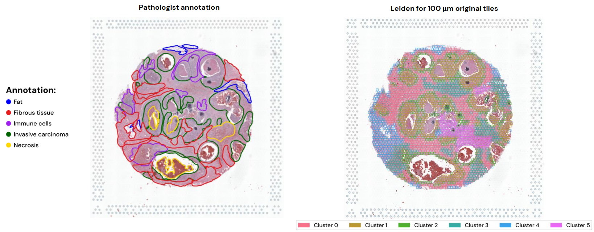

## Feature clustering

In this step we processed and tried to integrate image-derived features via dimensionality reduction and clustering, just like in a Single-Cell analysis. 

---

Being this process completely unsupervised and since we operated without training models for classification purposes, the identity of the generated clusters remains unknown. Before comparing this to their biological content, an initial assessment of the method can happen by comparison with the pathologist annotation. Here is an example for the Visium sample:

---

The folders are organised by extraction model.

Content of the folder:  
`4_features_clustering` 
`├── kimianet/` &rarr; scripts for feature processing from KimiaNet implementation 
`├── uni2_h/` &rarr; scripts for feature processing from UNI2 implementation 
`├── figures/` &rarr; figures derived from the scripts or Jupyter Notebooks organised per sample  
`├── utils/` &rarr; contains the used environments `.yaml` files and eventual useful scripts  
`└── output/` &rarr; contains the normalised tiles, organised per sample, WSI (original or normalised) and size, and results of metrics evaluation 

