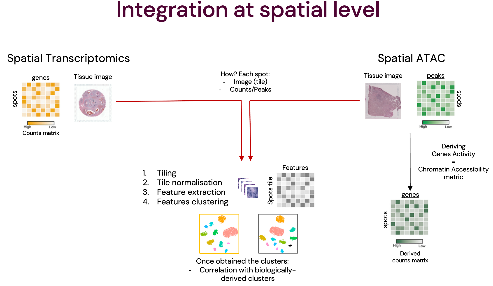
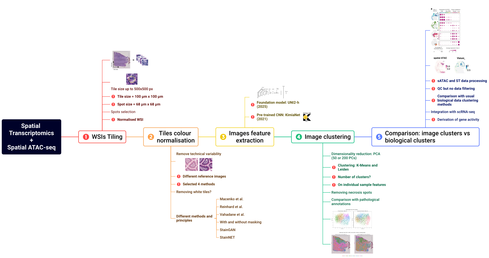

# Gabriele's Master thesis project

Hi! This is my Master's thesis project! 
I put a lot of effort in it, so I hope you'll find it interesting and fashinating as much as I did. 
Some modifications are still in progress, however, feel free to contact me at: gabriele.gambero1@gmail.com 

This repository contains the code and methodology implemented to understand whether the hispathological component of spatial omics can be used to bridge them, instead of using the way more common biological one.   

Author: Gabriele Gambero 
Supervisor: Dr. Carsten Daub  
Department of Medicine (Huddinge)  
Karolinska Institutet, Stockholm (Sweden) 

## Abstract

The modern state of bioscience is evolving at a never-seen-before pace. During the past decade we have witnessed the complete establishment of single cell technologies and the rise of spatial omics, co-occurred by deep learning implementations for biological advancements. As more and finer data are continuously being generated, more studies are coming together to elaborate revolutionary strategies that promise to unify nature-divergent insights. The perfect example of how such improvements are now coming together is the way in which we can computationally extract histopathological and molecular information from a solid sample section at the same time. In particular, spatial transcriptomic allows to simultaneously study gene expression and specimen morphology, whereas the derived Spatial ATAC returns chromatin accessibility and tissue organisation. However, as in both cases the first component is often the primar source of findings, the other tends to not be completely explorated, leaving studying opportunities. This report rapidly summarises how, given breast cancer samples from these two spatial omics, the field is rapidly developing but forgetting the histopathological sphere which instead shows to be a good common space for deep learning frameworks to integrate and unify the respective molecular features.

## Workflow

Here there is a quick overview of the basic integration idea and a more detailed version of the project workflow itself. 

**Integration scheme:**

---
**Project workflow:**

The project workflow was realised with [XMind® software](https://xmind.app/). 

## Data

As described in the `data` folder, just a single Visium Breast Cancer and a single Spatial ATAC Breast Cancer samples have been used. The patients, the state and the thickness of the sections are unmatching; only the subtypes were matching.

## Repository structure

`main` 
`├── 0_WSI_alignment_and_normalisation` &rarr; normalisation of WSIs 
`├── 1_tiling` &rarr; **real first step**: subdividing WSIs in tiles 
`├── 2_image_normalisation` &rarr; tile color normalisation 
`├── 3_features_extraction` &rarr; extraction of deep features from tiles 
`├── 4_features_clustering` &rarr; processing and clustering of tile features 
`├── 5_integration_and_correlation` &rarr; biological data processing and integration with tiles cluster 
`├── data` &rarr; samples origin and description 
`└── fonts` &rarr; font used for plotting (DM Sans) 
