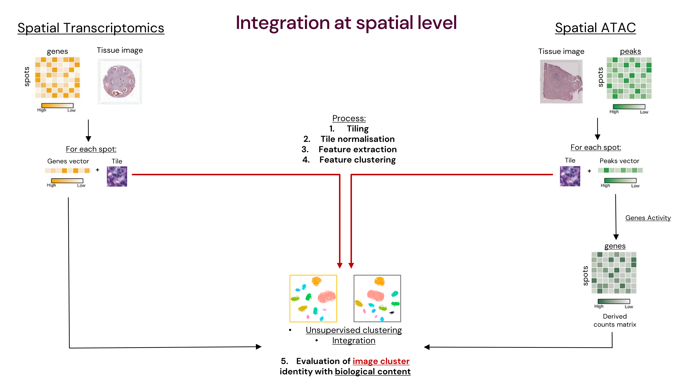

# Gabriele's Master thesis project

Hi! This is my Master's thesis project!

This repository contains the code and methodology implemented to understand whether the hispathological component of spatial omics can be used to bridge them, instead of using the way more common biological one.   

>Author: Gabriele Gambero 
Supervisor: Dr. Carsten Daub  
Academic Year: 2024/2025  
Department of Medicine (Huddinge)  
Karolinska Institutet, Stockholm (Sweden) 

## Abstract

The way spatial omics are bridging molecular findings and computational pathology is transforming
how we interrogate biological tissues. While Spatial Transcriptomics and Spatial ATAC provide gene
expression and chromatin accessibility, respectively, in a spatial context, both techniques also
produce histological images, an often underinvestigated but common output of such techniques. As
deep learning and foundation models mature, histopathological images can serve not only as
diagnostic tools but as computational bridges between divergent spatial molecular profiles.
In this thesis, we examine breast cancer samples processed through Spatial Transcriptomics and
Spatial ATAC to explore whether histological morphology can unify and reflect their molecular
landscapes. By extracting deep features from the studied Haematoxylin and Eosin (H&E) stained
sections using both specialised convolutional networks and multi-purpose foundation models, we
demonstrate the potential of morphology-informed integration. Notably, the general large model UNI2
outperformed domain-specific architectures, offering robust, resolution-independent clustering
aligned with diagnosis annotations, even in the presence of sparse or noisy molecular data. Overall,
image size did not lead to significantly divergent results. Instead, the multi-cell capturing nature of
both technologies caused less well-defined clusters for heterogeneous tissues, with groups often
displaying mixed cellular signatures. This observation was partially reflected by molecular data: while
Spatial Transcriptomics confirmed robust and reproducible patterns, the biological signal from Spatial
ATAC appeared noisier, reflecting the method’s earlier stage of development.
These findings emphasise the maturity of spatial omics and their previously overlooked value in
histopathological outputs, underscoring the capacity of foundation models to support multimodal
integration. While technical and sample limitations remain, this image-centred approach opens new
opportunities for bridging spatial modalities and improving insights in biological samples.

## Workflow

Here there is a quick overview of the basic integration idea and a more detailed version of the project workflow itself. 

**Integration scheme:**

---
**Project workflow:**

The project workflow was realised with [XMind® software](https://xmind.app/). 

## Data

As described in the `data` folder, just a single Visium Breast Cancer and a single Spatial ATAC Breast Cancer samples have been used. The patients, the state and the thickness of the sections are unmatching; only the subtypes were matching.

## Repository structure and how to replicate the work

`main` 
`├── 0_WSI_alignment_and_normalisation` &rarr; normalisation of WSIs 
`├── 1_tiling` &rarr; **real first step**: subdividing WSIs in tiles 
`├── 2_image_normalisation` &rarr; tile color normalisation 
`├── 3_features_extraction` &rarr; extraction of deep features from tiles 
`├── 4_features_clustering` &rarr; processing and clustering of tile features 
`├── 5_integration_and_correlation` &rarr; biological data processing and integration with tiles cluster 
`├── data` &rarr; samples origin and description 
`└── fonts` &rarr; font used for plotting (DM Sans) 

If you want to replicate my work, I've organised the repository in 5 steps + 1 (step 0). Inside each folder there is a description of its content and the environments used for running the code. The code is supposed to be almost automatic, after setting the few initial personalised variables (always in capital letters).